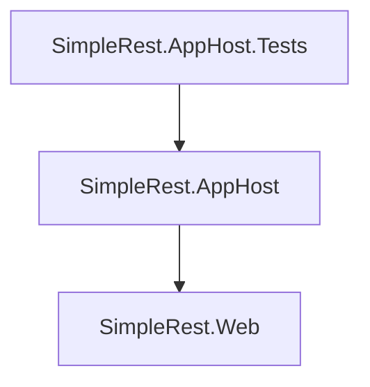

This is a small experimental app to see what NUnit-based integration tests would look like for a simple hello world endpoint hosted with Aspire Orchestration.

- Uses dotnet 9
- Just a single Minimal API with a hardcoded `"Hello World!"` response.
- A single test to make sure the root is being called successfully with the correct response
- You can run SimpleRest.Web straight from your IDE to see the Aspire Dashboard and hit any endpoints yourself!

Very reminiscent of WebApplicationFactory for an individual service.

I like it!

